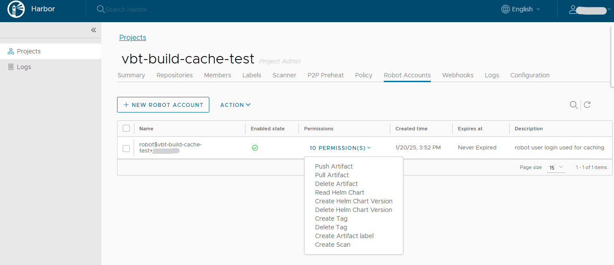

# VirtualBrainTwin

## Installation Prerequisites

1. **Checkout the source code from the repository using the following command**

    ```bash
    git clone https://gitlab.ebrains.eu/ri/projects-and-initiatives/virtualbraintwin/virtualbraintwin.git
    ```

2. **Before you can start the Virtual Brain Twin project, you need to install the following prerequisite tools.**

   1. **VirtualBox** - version 7.0.20
      - [Download VirtualBox](https://www.virtualbox.org/wiki/Downloads)

   2. **VirtualBox**
      - [Download Vagrant](https://developer.hashicorp.com/vagrant/install?product_intent=vagrant)

   3. **Vagrant Disksize Plugin**
    
       This plugin is used to custom configure the disk size allocated to the VM created with Vagrant.
      - [Download vagrant-disksize](https://github.com/sprotheroe/vagrant-disksize)
      
3. **Setting up the needed environment variables**

    **Setting up the needed environment variables**
    The ````<checkout path>\dedal\.env```` file contains the environment variables required for OCI registry used for caching.
    Ensure that you edit the ````<checkout path>\dedal\.env```` file to match your environment.
    The following provides an explanation of the various environment variables:


       # OCI Registry Configuration Sample for concretization caches
       # =============================
       # The following variables configure the Harbor docker OCI registry (EBRAINS) used for caching.
       
       # The hostname of the OCI registry. e.g. docker-registry.ebrains.eu
       CONCRETIZE__OCI_HOST="docker-registry.ebrains.eu"
       
       # The project name in the Docker registry.
       CONCRETIZE__OCI_PROJECT="concretize_caches"
       
       # The username used for authentication with the Docker registry.
       CONCRETIZE__OCI_USERNAME="robot$concretize-cache-test+user"
       
       # The password used for authentication with the Docker registry.
       CONCRETIZE__OCI_HOST="###ACCESS_TOKEN###"
        

       # OCI Registry Configuration Sample for binary caches
       # =============================
       # The following variables configure the Harbor docker OCI registry (EBRAINS) used for caching.
       
       # The hostname of the OCI registry. e.g. docker-registry.ebrains.eu
       BUILDCACHE_OCI_HOST="docker-registry.ebrains.eu"
       
       # The project name in the Docker registry.
       BUILDCACHE_OCI_PROJECT="binary-cache-test"
       
       # The username used for authentication with the Docker registry.
       BUILDCACHE_OCI_USERNAME="robot$binary-cache-test+user"
       
       # The password used for authentication with the Docker registry.
       BUILDCACHE_OCI_HOST="###ACCESS_TOKEN###"

For both concretization and binary caches, the cache version can be changed via the attributes ```cache_version_concretize``` and ```cache_version_build```. 
The default values are ```v1```.

    _Note: In the case of a Harbor registry, a registry project (REGISTRY_PROJECT) must be created, and a robot account (REGISTRY_USERNAME & REGISTRY_PASSWORD) should be added to the project, as illustrated in the image below. For more details, please refer to the user manual: Harbor Documentation - [Create Robot Accounts](https://goharbor.io/docs/1.10/working-with-projects/project-configuration/create-robot-accounts/)._
    
    
   
    After setting the environment variables, please ensure to execute the following commands to apply the necessary environment variables:
    - Windows Command line
      ````
      call <checkout path>\virtualbraintwin\installation\export_env.bat
      ````
    - Windows Powershell
      ````
      .\<checkout path>\virtualbraintwin\installation\export_env.ps1
      ````
    - Linux Bash
      ````
      export $(grep -v '^#' <checkout path>\virtualbraintwin\installation\.env | xargs)
      ````

## User:

Hardware prerequisites allocated to the Ubuntu VM for the installation of the packages from the buildcache:

- CPU: 2
- RAM: 2 GB

Hardware prerequisites allocated to the Ubuntu VM for the installation of the packages:

- CPU: 10
- RAM: 16 GB

This hardware may vary depending on what package is installed in the spack environment.

You can directly download the VM to attach it to VirtualBox by importing it as an appliance. The username and password are both "vagrant".

## Developer:

Hardware prerequisites allocated to the Ubuntu VM:

- CPU: 10
- RAM: 16 GB

You can start the local build of spack packages that will be pushed to docker registry by running the following command in /installation/local/VM_buildcache:
   - `vagrant up`

You can start the local installation by running the following command in /installation/local/VM_user:
   - `vagrant up`
   - _Once the user VM is up and running, the user can access the JupyterLab UI through a web browser using the following URL: https://host_server_ip:8888/_
   


In order to connect to the newly created VM, you need to run the following command in /installation/local/VM_user:
   - `vagrant ssh`

## Acknowledgments

This project has received funding from the European Union’s Research and Innovation Program Horizon Europe under Grant Agreement No. 101137289 (Virtual Brain Twin Project).